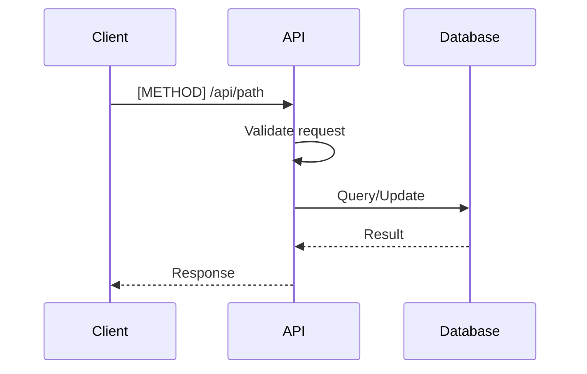

# [METHOD] /api/path

## Overview
Brief description of what this endpoint does.

## Endpoint
`[METHOD] /api/path`

## Authentication
- **Required**: Yes/No
- **Type**: Bearer Token / API Key / OAuth2
- **Scopes**: `scope:action`

## Rate Limiting
- **Limit**: X requests per Y seconds
- **Headers**: `X-RateLimit-Limit`, `X-RateLimit-Remaining`

## Request

### Path Parameters
| Parameter | Type | Required | Description |
|-----------|------|----------|-------------|
| `id` | string | Yes | Resource identifier |

### Query Parameters
| Parameter | Type | Required | Default | Description |
|-----------|------|----------|---------|-------------|
| `page` | integer | No | 1 | Page number for pagination |
| `limit` | integer | No | 20 | Items per page |

### Headers
```http
Content-Type: application/json
Authorization: Bearer <token>
Accept: application/json
```

### Body
```json
{
  "field1": "value1",
  "field2": 123,
  "field3": {
    "nested": "value"
  }
}
```

### Body Schema
| Field | Type | Required | Constraints | Description |
|-------|------|----------|-------------|-------------|
| `field1` | string | Yes | max: 255 | Description |
| `field2` | integer | Yes | min: 0 | Description |
| `field3` | object | No | - | Description |

## Response

### Success Response (200 OK)
```json
{
  "id": "uuid-here",
  "field1": "value1",
  "field2": 123,
  "created_at": "2025-10-29T12:00:00Z",
  "updated_at": "2025-10-29T12:00:00Z"
}
```

### Error Responses

**400 Bad Request**
```json
{
  "error": "validation_error",
  "message": "Invalid input data",
  "details": {
    "field1": ["Field is required"]
  }
}
```

**401 Unauthorized**
```json
{
  "error": "unauthorized",
  "message": "Invalid or missing authentication token"
}
```

**403 Forbidden**
```json
{
  "error": "forbidden",
  "message": "Insufficient permissions"
}
```

**404 Not Found**
```json
{
  "error": "not_found",
  "message": "Resource not found"
}
```

**429 Too Many Requests**
```json
{
  "error": "rate_limit_exceeded",
  "message": "Too many requests, please try again later"
}
```

**500 Internal Server Error**
```json
{
  "error": "internal_error",
  "message": "An unexpected error occurred"
}
```

## Examples

### cURL Example
```bash
curl -X [METHOD] \
  https://api.example.com/api/path \
  -H "Authorization: Bearer <token>" \
  -H "Content-Type: application/json" \
  -d '{
    "field1": "value1",
    "field2": 123
  }'
```

### JavaScript Example
```javascript
const response = await fetch('https://api.example.com/api/path', {
  method: '[METHOD]',
  headers: {
    'Authorization': 'Bearer <token>',
    'Content-Type': 'application/json',
  },
  body: JSON.stringify({
    field1: 'value1',
    field2: 123,
  }),
});

const data = await response.json();
```

### Python Example
```python
import requests

response = requests.[method](
    'https://api.example.com/api/path',
    headers={
        'Authorization': 'Bearer <token>',
        'Content-Type': 'application/json',
    },
    json={
        'field1': 'value1',
        'field2': 123,
    }
)

data = response.json()
```

## Business Logic

### Flow Diagram


### Validation Rules
- Rule 1: Description
- Rule 2: Description
- Rule 3: Description

## Performance Considerations
- **Average response time**: Xms
- **Database queries**: X per request
- **Caching**: Cached for X minutes
- **Optimization notes**: ...

## Security Considerations
- ✅ Input validation
- ✅ SQL injection prevention
- ✅ XSS prevention
- ✅ CSRF protection
- ✅ Rate limiting

## Testing

### Unit Tests
- Test case 1: Description
- Test case 2: Description

### Integration Tests
- Scenario 1: Description
- Scenario 2: Description

## Related Documentation
- [[API-Overview]]
- [[Authentication]]
- [[Error-Handling]]
- [[Schema-Name]]
- [[ADR-XXX]]

## Changelog
| Version | Date | Changes |
|---------|------|---------|
| 1.0 | 2025-10-29 | Initial creation |
